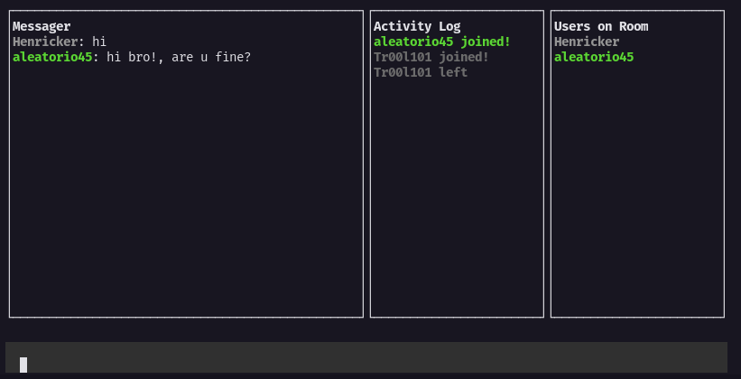

# Hacker-chat-terminal
 - A terminal chat created on node js both the backend and the frontend

 - The interface in the terminal was made with the aid of the blessed library, which is an external module downloaded via npm to model interfaces in the terminal

 - In the backend, I used only the native http modules for the creation of the system with sockets

 - In both (backend and frontend) I used the builder pattern, where it is used to instantiate more complex objects. In addition to an event-based architecture, each event broadcast has a feature

### Interface (front-end)
 - To start a room or enter a room just use the CLI commands

 ```bash 
  node index.js \ 
  --username username \
  --room room01 \
  --hostUri http://example.com
 ```

 - By default, if the hostUri is not informed, the client will use the backend in production

 - The frontend is divided into three parts, the first component refers to messages, the second to the component responsible for the user's outbound and inbound logs. Finally, the last component refers to the users who are currently in the chat, being updated with each departure or entry of new users

 

### Criticisms and suggestions?
 - I am open to criticism and suggestions on how to improve my project!
